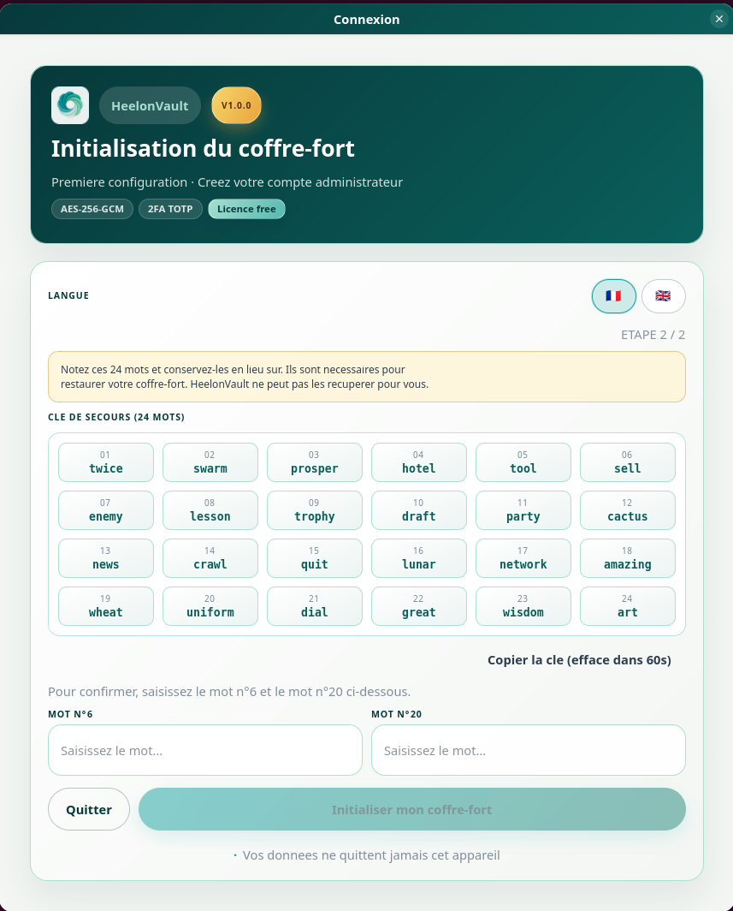
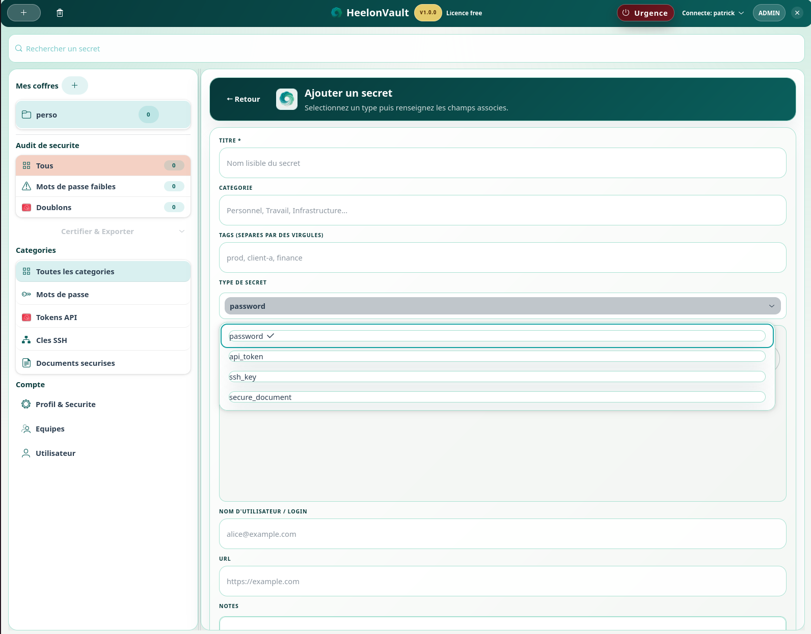
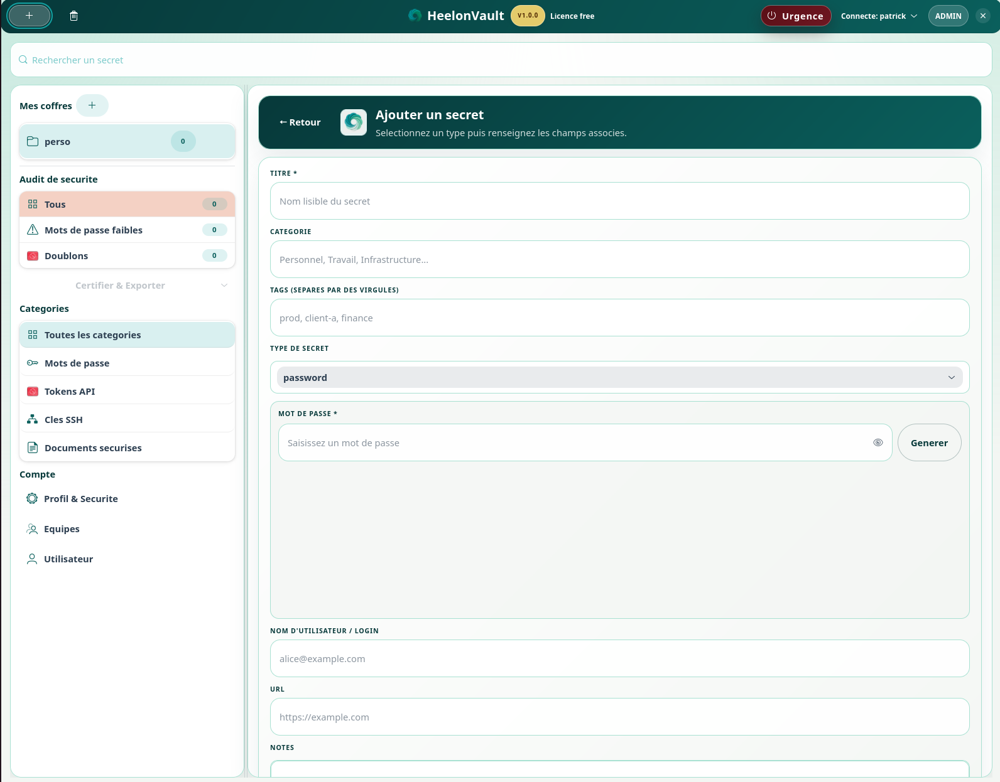
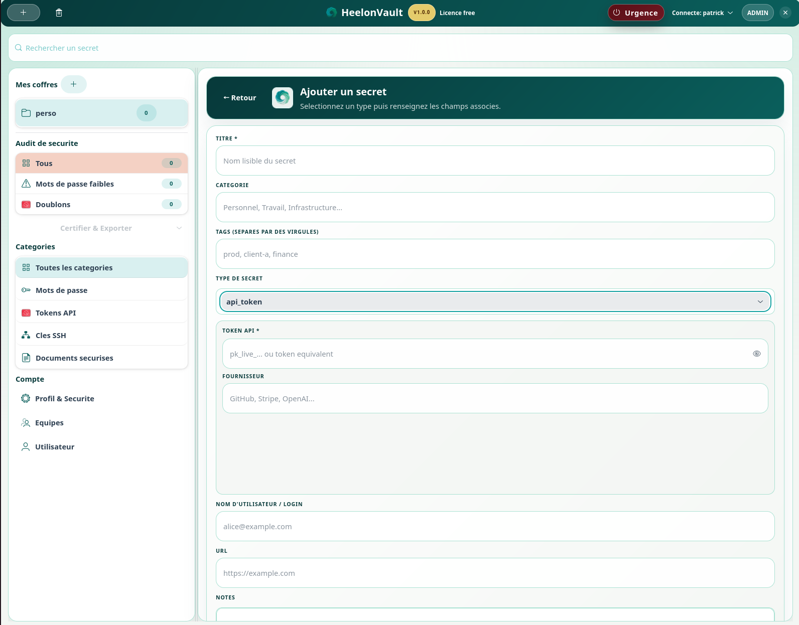
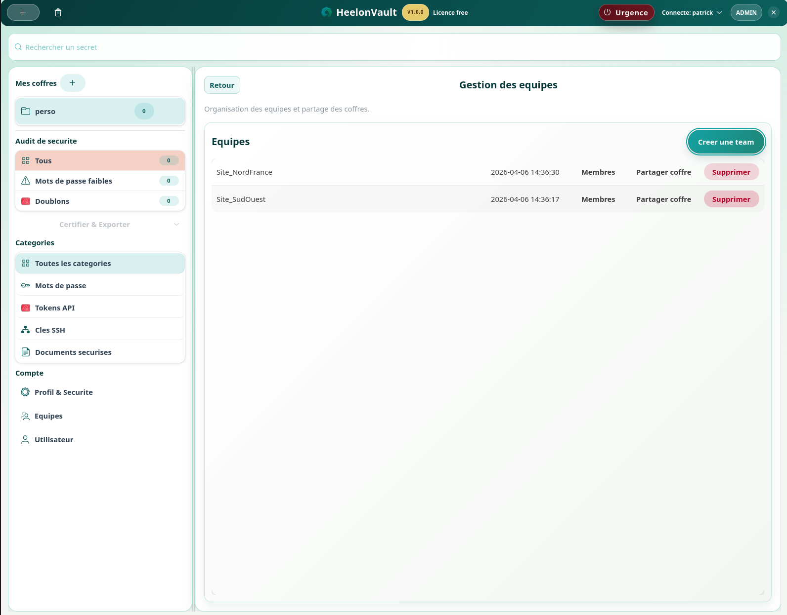

# User Guide

Language: EN | [FR](USER_GUIDE.md)

Documented target version: `1.0.3`

## Purpose

This user manual describes HeelonVault from an end-user perspective. It is intended for people who need to access, secure, organize, and maintain secrets in the product without relying on internal technical documentation.

The document follows the main product screens and explains, for each one, its role, the available actions, and the associated best practices.

This user guide covers day-to-day HeelonVault usage on the desktop side:

- first launch;
- sign-in and session security;
- creating, editing, and searching secrets;
- import, export, and trash workflows;
- security best practices.

## Table of contents

1. User journey overview
2. Screen 1 - Bootstrap wizard
3. Screen 2 - Sign-in
4. Screen 3 - Main vault view
5. Screen 4 - Create a secret
6. Screen 5 - Edit, delete, and trash
7. Screen 6 - Search and organization
8. Screen 7 - Profile and security
9. Screen 8 - Import and export
10. Screen 9 - Dashboard and audit
11. Best practices
12. Quick troubleshooting
13. Useful references

## Screenshot placeholders

Screenshots can be added later at the dedicated locations already prepared in this document. The numbering below makes it easier to align future visuals with the relevant product screens.

Suggested naming convention:

- `docs/images/user-guide/login-en.png`
- `docs/images/user-guide/dashboard-en.png`
- `docs/images/user-guide/editor-en.png`

## 1. User journey overview

The standard HeelonVault user journey usually follows this sequence:

1. initialize or open a vault;
2. sign in;
3. browse or search a secret;
4. create, edit, share, or delete an item;
5. manage session security and advanced operations.

This structure is used throughout the manual because it reflects the actual product flow experienced by end users.

## 2. Screen 1 - Bootstrap wizard

On first start, HeelonVault opens a guided bootstrap flow to create the first administrator account.

Screen role:

- prepare the vault for first use;
- create the first account with administration privileges;
- record the recovery information required for future access.

General steps:

1. Choose the administrator login.
2. Define a strong master password.
3. Save the generated recovery key.
4. Complete initialization and open the vault.

Important notes:

- the recovery key should be stored in a secure location outside the workstation;
- the master password directly affects vault access security;
- the process should not be interrupted before the displayed recovery material is safely recorded.

Screenshot placeholder: Screen 1 - bootstrap wizard

Capture 01a - Bootstrap wizard, step 1 (first administrator account creation).

Capture 01b - Bootstrap wizard, step 2 (24-word recovery key).

## 3. Screen 2 - Sign-in

After initialization, the sign-in screen accepts account credentials and, when enabled, the one-time TOTP code.

Screen role:

- authenticate the user;
- protect access to the vault;
- enforce configured account security rules.

Best practices:

- use a unique, long password;
- store the recovery key outside the workstation;
- verify system time if TOTP codes are rejected.

Screenshot placeholder: Screen 2 - sign-in

Capture 02 - Sign-in screen with username, password, and database recovery entry point (.hvb).

## 4. Screen 3 - Main vault view

Once signed in, the user reaches the main vault view with:

- the secrets list;
- search and filtering functions;
- create, edit, delete, and share actions;
- profile and security access.

Screen role:

- act as the main entry point for daily work;
- centralize vault navigation;
- provide fast access to priority actions.

Screenshot placeholder: Screen 3 - main window

Capture 03 - Main vault view with search, categories, security audit filters, and central workspace.

## 5. Screen 4 - Create a secret

To add a new secret:

1. Open the create action.
2. Select the appropriate type or category.
3. Fill in relevant fields: title, login, password, URL, notes, tags.
4. Review the strength indicator.
5. Save.

Recommendations:

- use explicit titles;
- add tags to improve searchability;
- avoid unnecessary sensitive notes.

From a product perspective, this is one of the key screens because it balances fast data entry with data quality and security requirements.

Screenshot placeholder: Screen 4 - secret editor

Capture 04a - Secret type selection (password, api_token, ssh_key, secure_document).

Capture 04b - Password secret creation form (main fields).

Capture 04c - Additional password-secret parameters (notes, validity, save actions).

Capture 04d - API token secret form.

Capture 04e - SSH key secret form.

Capture 04f - Secure document secret form.

## 6. Screen 5 - Edit, delete, and trash

Each secret can be edited from the integrated editor. Deletion goes through the trash to reduce the risk of immediate data loss.

Screen role:

- maintain existing vault content;
- secure deletion through an intermediate recovery step;
- provide fast restoration when needed.

Recommended flow:

1. Edit the secret if needed.
2. Use soft-delete to move it to trash.
3. Restore it if deletion was accidental.
4. Permanently purge only after confirmation.

Screenshot placeholder: Screen 5 - trash

Capture 05 - Trash view with restore and purge actions for deleted items.

## 7. Screen 6 - Search and organization

HeelonVault supports multi-field search across the main secret metadata.

Screen role:

- reduce the time needed to access information;
- keep the vault structured over time;
- preserve smooth day-to-day usage even with a large number of secrets.

To keep the vault readable:

- adopt a stable naming convention;
- use tags consistently;
- group secrets by type, use case, or team when relevant.

Screenshot placeholder: Screen 6 - search

Capture 06 - Search bar and left-side navigation used to organize and quickly retrieve secrets.

## 8. Screen 7 - Profile and security

From the profile area, users can review security- and session-related settings, including:

- TOTP activation;
- auto-lock policy;
- some display preferences depending on role and configuration.

Key recommendations:

- enable TOTP as early as possible;
- use a short auto-lock delay on shared workstations;
- never leave an open session unattended.

This screen is the core user trust area of the product. It contains the settings that most directly affect protection of the vault and session behavior.

Screenshot placeholder: Screen 7 - profile and security

Capture 07 - Profile settings, session security, TOTP controls, import/export, and preferences.

## 9. Screen 8 - Import and export

Depending on granted permissions, HeelonVault supports:

- CSV import;
- `.hvb` export;
- operations constrained by RBAC rules.

Before importing:

- verify file format and encoding;
- clean unnecessary columns;
- confirm the correct target vault.

Before exporting:

- limit the operation to the actual need;
- protect the exported file;
- delete the artifact after use when possible.

Screenshot placeholder: Screen 8 - import / export

Capture 08 - Data management area (.hvb export and CSV import) from Profile & Security.

## 10. Screen 9 - Dashboard and audit

The security dashboard provides a summary of vault health. Audit logs trace sensitive actions.

Screen role:

- quickly expose attention points;
- review recent activity;
- support security and compliance reviews.

Common use cases:

- identify weak secrets;
- review recent events;
- track deletions, edits, and sharing operations.

Screenshot placeholder: Screen 9 - security dashboard

Capture 09a - Main dashboard and security audit indicators.

Capture 09b - Team administration view (vault sharing and member management).

Capture 09c - User administration view (create users, roles, reset, delete).

## 11. Best practices

- Use a unique and strong master password.
- Enable TOTP as soon as the account is activated.
- Store the recovery key away from the machine.
- Lock or close the session when leaving the workstation.
- Review obsolete secrets regularly.
- Keep exports to a minimum.

## 12. Quick troubleshooting

### Unable to sign in

- verify the account name;
- verify the password;
- verify system time if TOTP fails.

### The application locks too quickly

- review the auto-lock delay in session-related settings.

### A secret seems to be missing

- check the trash first;
- review the audit log if available.

## Useful references

- [../QUICKSTART.md](../QUICKSTART.md)
- [ARCHITECTURE.en.md](ARCHITECTURE.en.md)
- [UPDATE_GUIDE.en.md](UPDATE_GUIDE.en.md)
